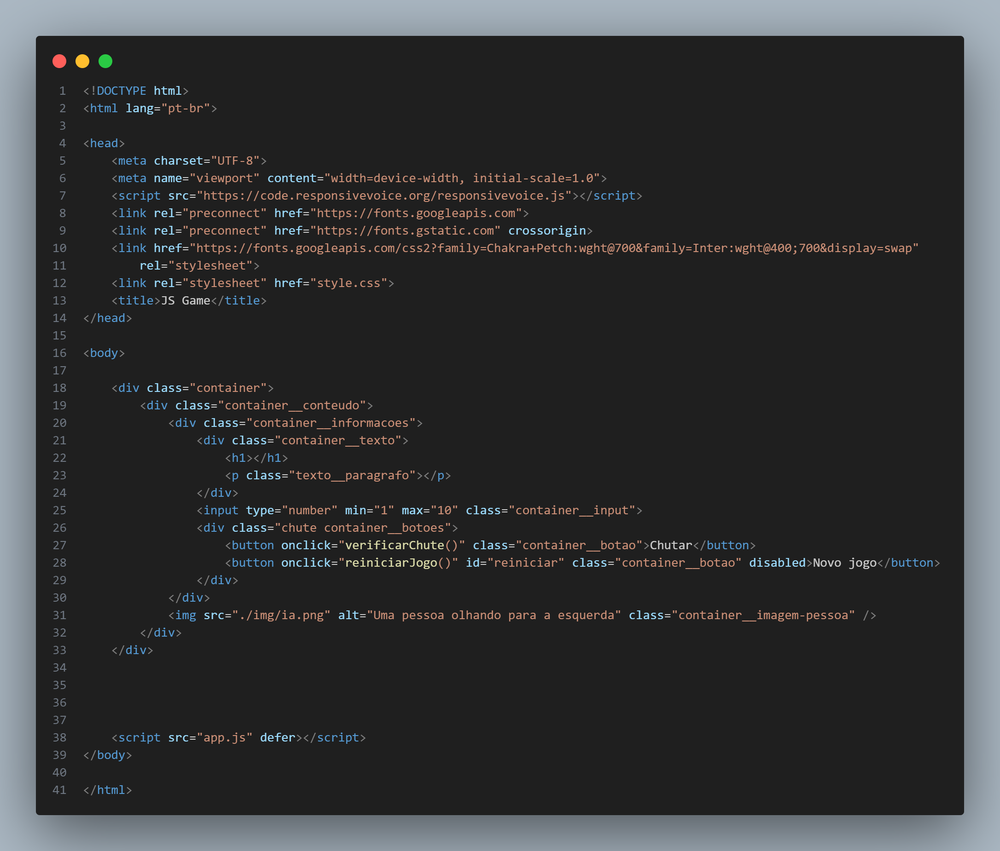
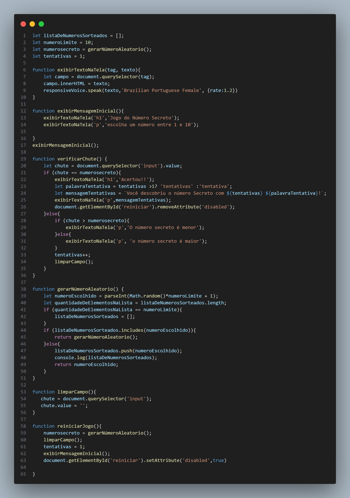

# Guess Game Javascript

Nesse projeto utilizamos o Javascript para desenvolver um jogo de adivinhação, que consiste em tentar adivinhar o número escolhido de forma randômica pelo programa, o programa não tem limite de tentativas.

## jogo

 

Como podemos acompanhar acima o jogo possui um campo para a adição do número e dois botões, o botão chutar que deve ser pressionado toda vez que adicionarmos um número, e o botão novo jogo que se tornará ativo apenas quando acertamos o número.
 

 
Após acertar o número o programa, nós informa o número de tentativas para chegar no número secreto, e ao errarmos o número o programa nos informa se o nosso "chute" é maior ou menor que o número secreto.

## Código

 
Chegamos então na parte de codigo do projeto, iremos começar com a base visual do projeto que consiste na nossa Linguagem de Marcação de Hipertexto o famoso HTML juntamente com o CSS.

 
Enfim chegamos ao coração do projeto e o motivo dele existir que é o nosso código Javascript, e vale ressaltar dois pontos que não foram citados acima, que é o fato de que nós utilizamos o Responsive Voice para que o navegador pudesse "Ler" o que está escrito na tela possibilitando pessoas com baixa visão também utilize nosso programa, e outro ponto é que o número secreto só irá se repetir após todas as possibilidades de números entre 1 e 10 forem adivinhados

